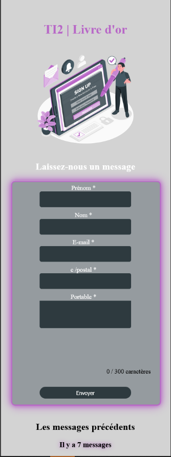
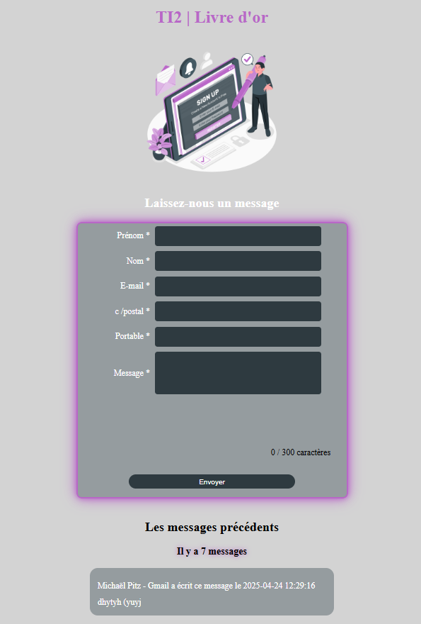
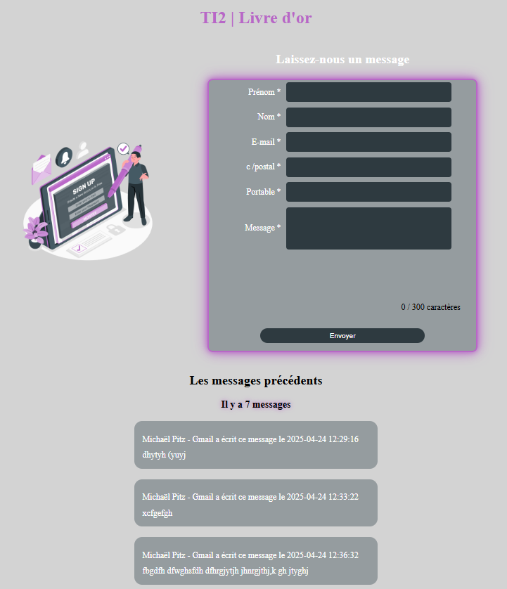

# TI2-2025

## WEBDEV 2025 


### PDF des consignes et la grille d'évaluation

Vous les trouverez dans le dossier `data/` du dépôt.

### Structure des fichiers

Tous ces fichiers **doivent** être dans le dossier `TI2-2025` :

    .gitignore
    README.md
    config.php // copie de config.php.ini
    config.php.ini
    data/
        data/ti2web2025.sql
        data/fig1_vue_smartphone.png
        data/fig2_vue_tablette.png
        data/fig3_vue_desktop.png
        data/Grille d'évaluation TI2 2025.pdf
        data/TI2 2025.pdf
    model/
        model/guestbookModel.php
    public/
        public/index.php
        public/js/
            public/js/validation.js
        public/css/
            public/css/style.css
        public/img/
            public/img/email.png
            public/img/favicon.png
            public/img/sign-up-amico.png
    view/
        view/guestbookView.php

### Structure de la base de données

Et de la table `guestbook` :

```sql

DROP DATABASE IF EXISTS `ti2web2025`;
CREATE DATABASE IF NOT EXISTS `ti2web2025` DEFAULT CHARACTER 
    SET utf8mb4 COLLATE utf8mb4_general_ci;
USE `ti2web2025`;

DROP TABLE IF EXISTS `guestbook`;
CREATE TABLE IF NOT EXISTS `guestbook` (
       `id` int(10) UNSIGNED NOT NULL AUTO_INCREMENT,
       `firstname` varchar(100) NOT NULL,
       `lastname` varchar(100) NOT NULL,
       `usermail` varchar(200) NOT NULL,
       `phone` varchar(20) NOT NULL,
       `postcode` varchar(4) NOT NULL,
       `message` varchar(500) NOT NULL,
       `datemessage` datetime NOT NULL DEFAULT current_timestamp(),
       PRIMARY KEY (`id`)
) ENGINE=InnoDB AUTO_INCREMENT=5 DEFAULT CHARSET=utf8mb4
    COLLATE=utf8mb4_general_ci;
```

## Marche à suivre

- Créez un fork du dépôt `TI2-2025` sur github.com puis clonez-le sur votre machine
- Créez un hôte virtuel dans WAMP sur le dossier `…/TI2-2025/public/` nommé `TI2-2025`
- Créez une base de données dans `phpMyAdmin` en important le fichier `ti2web2025.sql` (de préférence en `MariaDB`)
- Enregistrez une copie de `config.php.ini` en `config.php` en vérifiant que celà correspond aux paramètres de votre base de données !

## Consignes

Vous pouvez vous aider des fichiers vus au cours pour réaliser ce TP.

Évitez de copier/coller des bouts de code sans les comprendre. Pour prouver que vous avez compris, vous devrez être capable de les expliquer avec des **commentaires personnels**.

Les **IA** ne doivent pas être utilisées pour ce TP. Ni dans un site externe ni en autocompletion. Vous pouvez par contre vous aider d'internet pour des bouts de code précis.


#### Faites un `commit` à chaque étape validée

Il doit y avoir un minimum de 10 `commit` pour ce TP.

### Pull Request

Faites un `Pull Request` à la fin de votre TP. Vérifiez que vous avez bien suivi les consignes avant de le faire.

Si vous avez fini et que vous êtes satisfait de votre travail, faites les points Bonus (vous pouvez les faire sur une autre branche).

Si tout est bon, faites un `Pull Request` sur le dépôt original.

### N'envoyez pas votre pull request avant `16h30`

Occupez-vous ailleurs en attendant, n'aidez pas les autres stagiaires.

Des formateurs pourront vous aider si vous avez des questions.

## Design

### Formats responsive

#### Smartphone




#### Tablettes



#### Desktop



